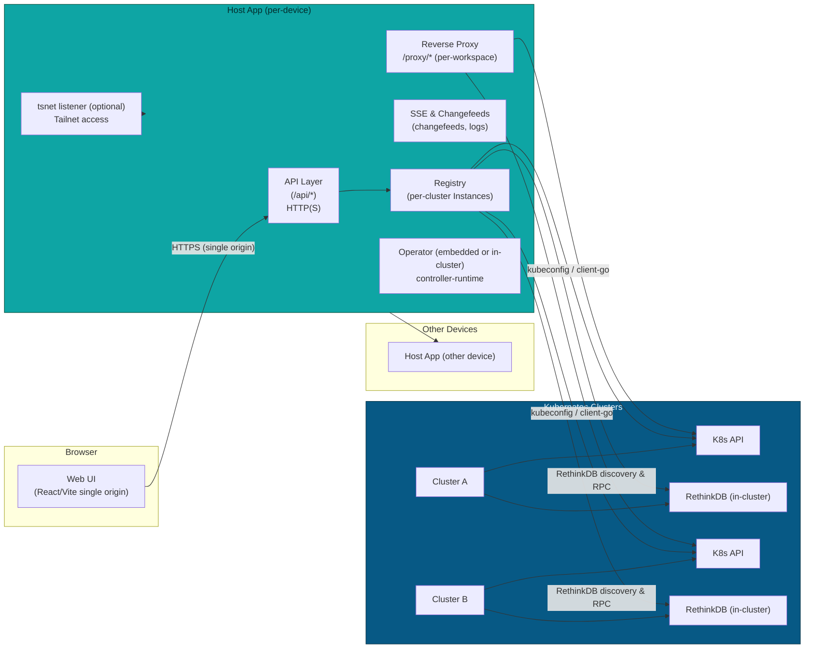

GuildNet Architecture (complete, code-driven)

This file now reflects the current codebase behavior and the features implemented across the Host App, embedded operator, proxying, and database management. The Host App is intended to run on every device in a fleet; each instance acts as a local portal and can join and manage multiple Kubernetes clusters by persisting per-cluster kubeconfigs and running per-cluster clients.

Dependency note: on 2025-10-19 a small set of patch-level dependency updates were applied and validated. Larger upgrades that require Go 1.24+ were deferred to preserve the current Go 1.23 toolchain.

### Component Overview (distributed)



Note: see ADR and implementation plan for multi-device federated clusters:
- ADR: `docs/adr/0001-multi-device-cluster.md`
- Implementation plan: `docs/implementation/0001-multi-device-cluster-implementation.md`

Multi-device operator notes
---------------------------

For operator-driven federation the operator requires a couple of runtime artifacts to operate non-interactively in multi-device tests:

- A valid `~/.guildnet/config.json` containing `login_server` and `auth_key` so tsnet can login to the headscale/tailscale server without interactive prompts. In-cluster operator deployments can mount this as a ConfigMap (we use `operator-config` in tests).
- TLS certificate and private key available under the operator's state path (e.g. `/root/.guildnet/state/certs/server.crt` and `/root/.guildnet/state/certs/server.key`). For development the repository `certs/` directory can be mounted into the pod as a ConfigMap (we use `operator-certs` in tests).

These two items are required for the operator to drive cross-device behavior: tsnet provides tailnet connectivity and the TLS certs allow the operator to serve secure endpoints and validate HostApp connections during verification. The verifier script `scripts/verify-federation-e2e.sh` will check that both devices see at least one common cluster and will deploy a minimal test workload to ensure both clusters can run the same image.

Containerized node runtime (k0s in Docker)
-------------------------------------------
- Each device can now run a self-contained node stack using Docker only: a privileged k0s container (controller+worker), an optional Tailscale container for tailnet routing, and a Docker-in-Docker daemon for local image builds. The script `scripts/k0s-node-up.sh` orchestrates these and emits a kubeconfig (default `~/.guildnet/kubeconfig`).
- The Host App consumes that kubeconfig unchanged. Deterministic cluster IDs and bootstrap flows work identically to other clusters. Per-cluster settings (APIProxyURL, PreferPodProxy, UsePortForward, etc.) apply as before.
- Inter-device networking is expected to use the tailnet; initial binding defaults to local-only for the API (127.0.0.1:16443) and can be exposed privately via Tailscale routing/serve in follow-ups.
- Local image pipeline for single-node clusters: for fast inner-loop development without a registry, images can be built inside the DinD container and imported directly into the k0s node's containerd (`ctr -n k8s.io images import`). When the image tag is non-latest (e.g., `:local`), the default Kubernetes `imagePullPolicy: IfNotPresent` ensures the locally imported image is used without external pulls. See `scripts/image-pipeline-smoke.sh` and `make smoke-image-pipeline`.
 - When a registry is desired, the DinD daemon is exposed on localhost (2375 plain, 2376 TLS) with a helper env file at `~/.guildnet/dind-env.sh`. The helper `scripts/dind-registry-push.sh` tags and pushes images from DinD to a registry, with a Makefile wrapper `make dind-image-push`.

E2E verification behavior with local-only API
- When a device runs k0s with the kube-API bound to 127.0.0.1, other devices' HostApp instances cannot reach the API directly. The e2e verifier (`scripts/verify-federation-e2e.sh`) treats the local cluster state as authoritative and will skip remote-perspective visibility/log checks if the remote HostApp returns an empty server list. In genuine single-node clusters (<2 nodes), remote-perspective checks are always skipped.
- Placement relies on the operator honoring the `guildnet.io/schedule-node` hint by setting a nodeSelector for `kubernetes.io/hostname`. If node labels/hostnames do not align or the scheduler cannot satisfy constraints, both workspaces may land on the same node; the e2e will warn and proceed in that case to prioritize end-to-end functionality over strict placement in constrained environments.
 - Tailscale is required. The repository-level `verify-e2e` script requires the subnet-router DaemonSet to be present and Ready; provide a valid `TS_AUTHKEY` (and `TS_LOGIN_SERVER` for Headscale) before running the verifier.

tsnet connectors and Headscale auth (implementation details)
-----------------------------------------------------------
- The Host App embeds per-cluster tsnet connectors. Each connector is configured with a login server URL and a preauth key.
- Auth key handling is centralized and deterministic:
  - Persisted keys are normalized to the canonical `tskey-<base64url>` form for storage.
  - On startup, the connector resolves the configured key to the raw-hex bytes Headscale expects and passes that to tsnet. This ensures non-interactive login without relying on environment variables or interactive flows.
  - If a raw-hex key is provided directly, it is used as-is.
- No fallback restart logic is used in production: the connector does not remove `tailscaled.state` or force restarts. If login fails, health is surfaced and Headscale remains the source of truth for device identity. Operational tooling should remediate by fixing configuration or preauths.
- The connector probes the login server (`/key?v=1`) with short timeouts before start and rewrites to `127.0.0.1:<port>` when it detects the target is local and loopback is listening; this avoids hairpin routing surprises during local Headscale deployments.


Connecting multiple devices (concept)

Overview
- The `Registry` maintains per-cluster `Instance` objects (kubeconfig, k8s client, dynamic client, local DB). Multiple Host App instances coordinate via the cluster control plane and share published-service mappings for cross-device access.

Mirror & resync mechanism (short)
- When a Host App publishes a service, it mirrors the mapping into `guildnet-system/published-<id>` in the cluster. Other devices read that ConfigMap and resync local listeners/proxies so published services are visible across devices.

Bootstrap & coordination (short)
- Devices join by submitting a `guildnet.config` (or kubeconfig) to an existing Host App via `POST /api/bootstrap`. The receiver persists the kubeconfig and runs a short pre-warm probe. Leader election (controller-runtime) ensures only one reconciler actively changes cluster-scoped resources at a time.

Deterministic cluster identity
------------------------------
- Cluster identity is derived deterministically from kubeconfig content (normalized API server URL and certificate-authority material). This ensures all devices that attach the same kubeconfig compute the same canonical cluster ID and therefore operate on the same logical cluster record.
- The attach path `POST /api/deploy/clusters/{id}?action=attach-kubeconfig` accepts any placeholder ID. The server computes the canonical ID and creates a cluster record with state `imported` if missing, enabling late attachment of secondary devices without re-running full bootstrap.

For full, step-by-step how-to (commands, examples, and troubleshooting), see `DEPLOYMENT.md` → "Connecting multiple devices to the same cluster". Keep `architecture.md` focused on the conceptual behavior and integration points.

Device ownership of capabilities
--------------------------------
In the multi-device design, individual Host App devices are the authoritative source for their local capabilities (CPU, memory, storage, VRAM, tailnet IPs). The cluster remains the source-of-truth for any data that must be identical or replicated across devices (for example, published service mappings mirrored into a ConfigMap). Devices report capabilities via a heartbeat (`POST /v1/sites/heartbeat`) which the Host App persists per-cluster. The placement planner and UI prefer those device-reported capabilities when present.

In-cluster DeviceParticipant SOT and name sanitization
-----------------------------------------------------
- When credentials/RBAC allow, Host App upserts a `DeviceParticipant` CR in the `guildnet-system` namespace to represent device participation in-cluster. This CRD is the canonical source-of-truth for which devices participate in a cluster.
- Device identifiers used as Kubernetes resource names are sanitized to valid RFC 1123 DNS subdomain names (lowercase, [a-z0-9-], start/end alphanumeric, max 253 chars) to avoid resource creation errors when hostnames include uppercase or unsupported characters.


High level summary

- Per-cluster kubeconfigs: the Host App stores kubeconfigs in local state and looks them up under the DB key `credentials:cl:{id}:kubeconfig` when creating per-cluster `Instance` clients. For interactive dev flows the code now prefers `~/.guildnet/kubeconfig` as the default kubeconfig before `~/.kube/config`.
- `POST /api/bootstrap` accepts a join payload (`guildnet.config` file or JSON with `cluster.kubeconfig`), persists a cluster record and kubeconfig, then performs a bounded pre-warm (10s) which attempts a light Kubernetes API call and a short `EnsureRDB`.

Developer teardown helper
-------------------------

For local development there is a guarded Makefile helper that performs a best-effort full teardown of local GuildNet artifacts (Headscale container, Tailscale router, Host App process, temporary cluster records, and local GN state). It is destructive to local state (removes `~/.guildnet` and the `GN_KUBECONFIG` file by default). Use only for disposable test environments:

```bash
make reset MAKE_RESET_CONFIRM=1
```

Multi-device bootstrap note

For a simplified multi-device flow (Device A host + Device B joiner), see the multi-device helpers:
- Make targets: `make multi-device-host`, `make multi-device-joiner`
- Script: `scripts/multi-device-setup.sh`

These orchestrate Headscale/tailscale, k0s-in-Docker, CRDs/addons, operator, Host App startup, and `/bootstrap` attach in one step per device.
 - Multi-device resilience: the embedded/in-cluster operator uses controller-runtime leader election so only one leader reconciles at a time across devices. Published service mappings are mirrored into an in-cluster ConfigMap (`guildnet-system/published-<id>`) which allows devices to resync published endpoints consistently after restarts.
- The Registry builds and caches `Instance` objects. Each `Instance` encapsulates:
  - per-cluster SQLite (`internal/localdb`)
  - `k8s.Client` and rest.Config (`internal/k8s`)
  - a dynamic client for CRD operations (`Instance.Dyn`)
  - a port-forward manager (de-duplicated per Instance)
  - a lazily-initialized RethinkDB manager via `Instance.EnsureRDB` (used by DB APIs and pre-warm)

### Dynamic Workspaces & code-server behavior

- The Host App exposes HTTP APIs and UI-first flows to create Workspaces; user requests are translated into `Workspace` CRs in the target cluster via the per-cluster client.
- The Workspace reconciler (`internal/operator/workspace_controller.go`) ensures Deployments and Services for each Workspace. Important behaviors:
  - Default container port is 8080 when `spec.ports` is omitted.
  - The controller ensures `PORT=8080` and sets a `PASSWORD` env for code-server images when none is provided (defaults to `changeme` in dev flows).
  - For code-server images (detected by image name substrings) the reconciler injects args so the server binds to `0.0.0.0:8080` and uses `--auth password`.
  - The reconciler supports unprivileged image patterns (nginx/cache) by applying an initContainer that chowns cache paths and mounting an `emptyDir` where appropriate, plus setting PodSecurityContext (fsGroup/runAsUser) so containers can write caches without requiring privileged images.
  - Services are created with `publishNotReadyAddresses=true` so the Host App proxy may route while pods are warming; the controller can set `Service.type=LoadBalancer` when requested via `Workspace.Spec.Exposure`.

This allows the system to spin up code-server and similar IDE images and make them accessible via the Host App reverse proxy.

### Reverse proxying and websockets

- Transport selection: the reverse proxy (`internal/proxy/reverse_proxy.go`) supports multiple resolution/transport modes in this priority:
  1. Dial the Service IP (ClusterIP) or LoadBalancer IP.
  2. Dial a host:port hint (if `AGENT_HOST` or similar hint is present).
  3. Use an API-proxy transport (for API-like paths) when a local `kubectl proxy` or API-proxy transport is available.
  4. Fallback to a managed SPDY port-forward (routes to `127.0.0.1:<pf>`) when direct connections are not available.
- The proxy composes two http.Transports and a `dualTransport` that uses the API-proxy transport for API paths and the standard transport for normal traffic.
- WebSocket upgrades are supported and tested via `tests/ws_proxy_test.go`.
- Header rewriting: the proxy rewrites `Location` and `Set-Cookie` attributes (drops Domain, sets Secure, SameSite=None, normalizes Path) and sets `X-Forwarded-Prefix` so embedded UIs served from a subpath behave correctly within an iframe.

Dev convenience: the router can detect a local `kubectl proxy` and rewrite cluster REST Hosts to `http://127.0.0.1:8001` when available; this provides a fast local transport in dev runs and avoids certificate or network mismatches.

### Database (RethinkDB) operations and UI features

- Discovery logic (`internal/db/cluster.go`) attempts to find a reachable RethinkDB endpoint using:
  1. Explicit address override (if provided)
  2. LoadBalancer Ingress (Service)
  3. NodePort (resolving node IPs)
  4. ClusterIP
- Connections use rethinkdb-go with short timeouts and small pools. `Instance.EnsureRDB` establishes the connection; handlers use `Registry.RDBPresent(clusterID)` to avoid triggering long reconnect attempts.
- The Host App implements a DB management API used by the UI, including create/drop DBs, list/create/drop tables, row CRUD endpoints, import/export, permission and audit endpoints, and streaming SSE changefeeds.

### Join/bootstrap flow and cluster management

- `scripts/generate_join_config.sh` produces `guildnet.config` join artifacts used by the UI and automation.
- `POST /api/bootstrap` persists cluster records and kubeconfigs, then pre-warms clients and RDB connectivity. Pre-warm of the DB is best-effort; API connectivity must succeed.

### Operator modes and CRDs

- CRDs for `Workspace` and `Capabilities` live in `config/crd/`.
- Operator modes supported:
  - Embedded (in-process) operator: default dev flow when running `./scripts/run-hostapp.sh` — easy feedback, single binary.
  - In-cluster operator: recommended for production (Deployment in `guildnet-system`).
  - System-installed operator via systemd: supported but can cause collisions with manual runs (systemd unit files are provided in packaging). If you run manually for debugging, mask/disable the systemd unit to avoid duplicate operators and unexpected shutdowns.

- The reconciler uses controller-runtime's `CreateOrUpdate` patterns and updates Workspace Status fields: `ServiceDNS`, `ServiceIP`, `ReadyReplicas`, `Phase`, and `ProxyTarget`.

### API Surface (summary)

- Health & status
  - GET `/healthz` — quick liveness & readiness checks

- Join/bootstrap
  - POST `/api/bootstrap` — accept join file or JSON with kubeconfig and optional hints (pre-warm clients)

- Jobs / Workspaces
  - POST `/api/jobs` — create a workspace (translates to a Workspace CR)
  - GET `/api/jobs`, GET `/api/jobs/{id}` — list and inspect

- Per-cluster operations
  - GET/PUT `/api/settings/cluster/{id}` — cluster settings (persisted in per-cluster local DB; PUT triggers graceful restart)
  - GET `/api/cluster/{id}/servers` — list workspaces
    - Enriches each record with the machine identity when available by:
      - Listing pods with label `guildnet.io/workspace=<name>` to determine the node hosting the workspace.
      - Cross-referencing `DeviceParticipant` CRs in `guildnet-system` to attach `machineName` and `tailnetIPs`.
    - When DeviceParticipant data is missing, only the `node` field is returned.
  - POST `/api/cluster/{id}/workspaces`
    - The Host App injects a metadata label `guildnet.io/schedule-node` set to the launching device's hostname.
    - The operator reads this label and sets a nodeSelector for `kubernetes.io/hostname` so the workspace is scheduled on that device's node.
    - This requires that each device is a node in the same Kubernetes cluster and node names match the device hostnames (or that your nodes are labeled accordingly).
  - DELETE `/api/cluster/{id}/workspaces/{name}`
    - Deletes a single Workspace CR. This endpoint powers the UI "Shutdown" action available from the Servers list and Server detail page.
  - Proxy: `/api/cluster/{id}/proxy/server/{name}/...` — proxy to workspace servers (sets `X-Forwarded-Prefix`; base-path may return 302 to `./login` for apps like code-server)

- Database API (per cluster)
  - GET/POST `/api/cluster/{id}/db` — list/create DBs
  - /tables and /rows endpoints for table and row operations
  - Import/Export, permissions, audit endpoints
  - SSE changefeeds: `/sse/cluster/{id}/db/{dbId}/tables/{table}/changes`

Multi-device Sites API
----------------------
- GET `/api/v1/sites` — aggregated per-device records. The server sets a canonical `clusterId` per record.
- For the device hosting the current Host App instance, the server marks the record with `self: true` and omits `lastSeen` (null). This allows the UI to hide the local device from “remote sites” listings without ambiguous online/offline status.

### Wiring, lifecycle and implementation notes

- `Registry.Get(ctx,id)` creates and caches `Instance` objects. `Registry.RDBPresent` avoids expensive RDB initialization during normal request handling.
- Port-forwards are used only as fallbacks for UI/IDE proxying and are de-duplicated per Instance.
- The dynamic client for CRDs is created once per Instance and reused.

### Observability and metrics

- Structured logs contain request IDs and component prefixes. The operator and Host App log lifecycle events (bootstrap, instance create/close, RDB connect).
- The Host App exposes `/healthz` and cluster-level health endpoints for local DB and RethinkDB.
- A debug log in `cmd/hostapp/main.go` prints the resolved REST host at startup (useful to confirm which kubeconfig was used during runs).

### Security and headers

- HTTPS: Host App serves TLS locally (configurable `LISTEN_LOCAL`) and supports tailscale/tsnet listeners. Certificates are read from `./certs/` or generated under `~/.guildnet/state/certs/`.
- The reverse proxy rewrites cookies and Location headers so embedded IDEs work from a single origin.
- No built-in user auth; recommended deployments put Host App behind tailscale or an external auth proxy and rely on Kubernetes RBAC.

### Operational notes & recent debugging artifacts

- Run modes & systemd: the repo includes `systemd` unit files as optional packaging (`/etc/systemd/system/guildnet-hostapp.service` and `.path`) which will restart the binary on changes. During debugging we observed that a system-installed `hostapp operator` can race with a manually started hostapp (the operator may send shutdown signals). For manual development, mask/disable the systemd units and run `./scripts/run-hostapp.sh` instead.
- Local kubectl proxy: the router can prefer a local `kubectl proxy` at `127.0.0.1:8001` when available. Running `kubectl proxy --kubeconfig=~/.guildnet/kubeconfig --address=127.0.0.1 --port=8001` reduces TLS/host mismatch issues in dev.
- Calico IPAM: a prior debugging session discovered orphaned Calico IPAMBlock CRs that exhausted per-host allocation and prevented PodSandbox creation. We used conservative cleanup scripts (examples left under `tmp/` during investigation) that back up `IPAMBlock` CRs and delete orphaned ones, and restarted `calico-kube-controllers` to re-sync. This is a developer-level mitigation for stuck clusters; production clusters should be monitored for IPAM saturation.
- Verifier: `scripts/verify-workspace.sh` is a small end-to-end smoke test that creates `verify-code-server-e2e` and probes the Host App proxy; it records probe outputs into `/tmp`.

Recent fixes (2025-10-21):
- The proxy reconciler was explicitly named `proxy-reconciler` to avoid controller-runtime duplicate-name collisions when multiple controllers are registered. This fixed an in-cluster operator startup failure observed during local testing.
- Missing GuildNet CRDs (federatedclusters, federatedservices, sitestatuses, etc.) were applied from `config/crd/bases/` to the test cluster to ensure all reconcilers operate correctly.

Note: The verifier `scripts/verify-e2e.sh` was recently updated to be more robust across Headscale CLI versions and to follow redirects when probing HostApp proxy endpoints.

### Signals and graceful shutdown

- The Host App now handles only SIGINT and SIGTERM for shutdown. SIGHUP and SIGQUIT are ignored to avoid accidental exits during log rotation or terminal events.
- On Linux, the process requests a parent-death signal (SIGTERM) so if the supervising shell dies, the Host App exits cleanly instead of orphaning. When launching from ephemeral shells, you can disable this behavior with `GN_DISABLE_PDEATHSIG=1`.
- Recommended: start via `scripts/run-hostapp.sh` or the editor task “Run server and tail logs” so a supervising shell remains alive and pdeathsig won’t trigger unexpectedly.

### Developer & deployment workflow

- `scripts/k0s-node-up.sh` — provision k0s-in-Docker and write kubeconfig to `~/.guildnet/kubeconfig`.
- `scripts/deploy-metallb.sh` — install MetalLB for LoadBalancer IPs in local clusters; on fresh k0s-in-Docker it temporarily sets the validating webhook failurePolicy to Ignore and retries until admission is available.
- `scripts/deploy-operator.sh` — apply CRDs, create `guildnet-system` namespace and deploy the in-cluster operator (image configurable via env/IMAGE).
- `scripts/run-hostapp.sh` — recommended dev flow; sets `KUBECONFIG=~/.guildnet/kubeconfig` when present, stops any existing hostapp listening on the chosen port, and starts `bin/hostapp serve` with an embedded operator.
- `scripts/deploy-tailscale-router.sh` — deploy a Tailscale subnet-router DaemonSet; it normalizes hex preauth keys to the canonical `tskey-...` form and keeps the pod running even if `tailscale up` initially fails so you can inspect logs and retry.

### Future small improvements (suggestions)

- Add a short `README` snippet or `docs/bootstrap.md` showing the exact `POST /api/bootstrap` JSON and form upload shape and an example `guildnet.config`.
- Add a `make recreate-dev` or `make dev-setup` target that wires `scripts/k0s-node-up.sh`, `scripts/deploy-metallb.sh` and `kubectl apply -f k8s/rethinkdb.yaml` for easier local setup.
- Make `scripts/deploy-operator.sh` accept a `LOCAL_IMAGE` argument or provide instructions to import the operator image via DinD/registry when necessary for local operator image testing.

If you want, I can add any of the small follow-ups above (README snippet, Make target, or deploy-operator enhancements).

````

